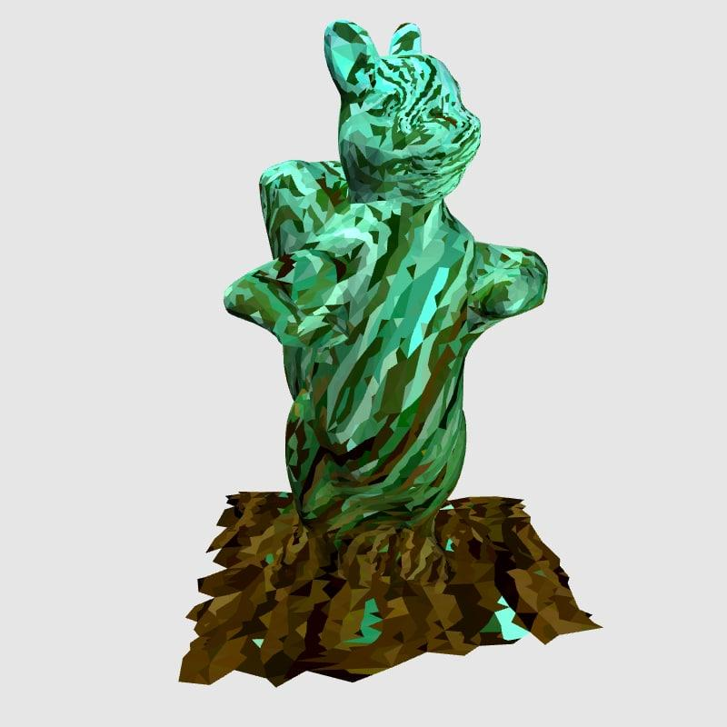

# Acoustic Gardens

> By popup team Biocenosis Labs for SNI Winter Hackathon 20222

## Overview

The sonic territory of non-human beings is often neglected and misunderstood, despite the importance of sound as an ecosystem health indicator.

Acoustic Gardens is an ecosystem of sonic applications for participatory engagement and reward for the monitoring and increase in biodiversity.

The Acoustic Gardens::'Encounter' app in this repository facilitates an interactive, meditative encounter, for humans to become acoustic guardians of their locality. contributing collectively to the growth of digital genius loci, or spirits of place.

The users, Acoustic Guardians, record local ecosystem sounds, which are added to a licensed dataset. In reward for participating in ecological sensing, humans receive feedback from the digital genius loci and a profit share from their contributions. By participating, guardians are bound economically to re-wild and preserve ecological space.

## Technology Roadmap

## Proof Of Concept 'Hack'

- [x] Front-end mobile web-app for recording geotagged audio recordings.
- [x] Uploading these audio recordings to the server.
- [x] Back-end server app for securely uploading and storing audio datasets.
- [x] Server side integration for generation and storage of audio parameters contributing to the Spirits in nearby locations.
- [x] Offline ML for bird song recognition
- [x] Offline generative 3D renderings of GCI Spirit of a place.
- [ ] Ocean Protocol Tokenized dataset of acoustic recordings.

## Phase 1

- Online Machine Learning pipeline for ecological sound and non-speech classification.

- Play your unique sound print: Generative online listening stream of segmented and remixed acoustic recordings in your local area, increasing the radius and diversity as you contribute more recordings.

## Phase 2

- All audio recordings are minted as individual NFTs for your ownership through unique.network.

- A Data Cooperative 'Data DAO' formed that all guardians automatically become a member of when they contribute recordings to. Powered by Ocean Protocol and Hive Gardens.

- As generative 3D visualisations of the Spirits of a Place evolve due to a increased sense of biodiversity in audio recordings, their avatars are minted as a set of 50 NTFs and listed on Open Sea. Revenue from the buyers of these evolving spirits of a place get split between contributors of acoustic samples - Rewarding those who are continiously engaging and acting to increase biodiversity in their area.

---

By participating, guardians are bound economically to rewild and preserve ecological space, - but most of all, bound to consider ourselves as in relationship with other spirits of the earth.
